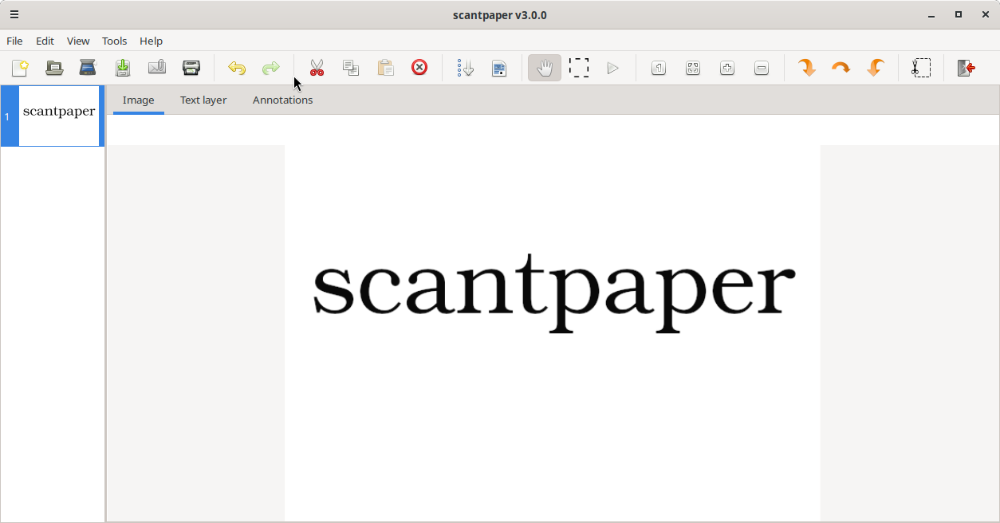

# Scantpaper

A GUI to produce PDFs or DjVus from scanned documents.

Scantpaper is a Linux application (it needs GTK3, SANE, and a Python 3
interpreter, all of which are available on other Unix-like systems like MacOS or BSD as well).
It is the Python rewrite (v3) of the popular
[gscan2pdf](https://gscan2pdf.sourceforge.net/).

[](https://github.com/carygravel/scantpaper/actions/workflows/test.yml)
[](https://github.com/carygravel/scantpaper/actions/workflows/deb.yml)
[](https://github.com/carygravel/scantpaper/releases)
[](https://www.gnu.org/licenses/)

- **Scan** single- or double-sided, with automatic interleaving
- **OCR** with tesseract for searchable PDF/A, without the need for temporary files
- **Edit** with crop, rotate, threshold, unsharp mask, and unpaper clean-up
- **Save** as PDF, DjVu, TIFF, PS, TXT, hOCR, or image files
- **Recover** crashed sessions and restore them on the next start

<p align="center">
    
    <em>Screenshot: Main page</em>
</p>

---

## Table of Contents

- [Quick Start](#quick-start)
- [Description](#description)
- [Command-line Options](#command-line-options)
- [Diagnostics](#diagnostics)
- [Configuration](#configuration)
- [Dependencies](#dependencies)
- [Download, Installation & Removal](#download-installation--removal)
- [Support](#support)
- [Reporting Bugs](#reporting-bugs)
- [Translations](#translations)
- [FAQs](#faqs)
- [Known Limitations](#known-limitations)
- [See Also](#see-also)
- [History](#history)
- [Author](#author)
- [Thanks To](#thanks-to)
- [Contributing](#contributing)
- [Donate](#donate)
- [License](#license)

---

## Quick Start

Install scantpaper and its dependencies (see [Download, Installation & Removal](#download-installation--removal)), then:

1. Start the application with `scantpaper` (or `python3 scantpaper/app.py` from a source checkout).
   Add `--debug|info|warn|error|fatal` to enable logging at the required level.
2. Scan one or several pages with **File → Scan**.
3. Select the pages and create a PDF with **File → Save**.
4. To make the saved PDF searchable, enable **OCR** in the scan window or run **Tools → OCR** before saving.

---

## Description

scantpaper provides a GUI for scanning, editing, and saving documents as PDF, DjVu, TIFF, PS, TXT, hOCR, SDB (scantpaper session), or image files (PNG, JPEG, PNM, GIF), and can prepend or append to an existing PDF. It supports batch scanning, metadata, OCR, and various editing tools.

### How it works

Scans are acquired with SANE and held in a session database while you edit
them. When saving, PDFs are produced with `img2pdf` and OCR'd with `ocrmypdf`
(which produces PDF/A out of the box); DjVu export uses `djvulibre-bin`, TIFF
export uses `libtiff`, and images are written with ImageMagick.

```
┌─────────┐   ┌─────────────────┐   ┌──────────────┐   ┌──────────────────┐
│  SANE   │   │ SQLite session  │   │ edit tools / │   │ img2pdf /        │──▶ PDF (PDF/A)
│ scanner │──▶│ (pages in temp  │──▶│ OCR          │──▶│ ocrmypdf         │
│         │   │  directory)     │   │ (tesseract)  │   ├──────────────────┤──▶ DjVu
└─────────┘   └─────────────────┘   └──────────────┘   │ djvulibre-bin    │
                                                       ├──────────────────┤──▶ TIFF
                                                       │ libtiff          │
                                                       ├──────────────────┤──▶ PNG, JPEG, PNM, GIF
                                                       │ imagemagick      │
                                                       └──────────────────┘
```

### Page Numbering

Page numbers are always consecutive (1, 2, 3, …). Deleting a page renumbers the
remainder automatically, and editing a page's number in the document table moves
that page to the corresponding position.

### Scan Flow

- **Single-sided:** Each scan is appended at the end.
- **Double-sided:** Scan all facing pages first (front 1, front 2, …, front n);
  they are appended in order. When you flip the stack the ADF feeds them in
  reverse (back of page n, then back of page n-1, …, back of page 1). Each
  reverse page is inserted immediately after its matching front page, producing
  a fully interleaved result: front 1, back 1, front 2, back 2, …, front n,
  back n.

  ```
  scan pass 1 (fronts):     front 1, front 2, ..., front n
  flip stack
  scan pass 2 (backs):      back n, back n-1, ..., back 1
  interleaved result:       front 1, back 1, front 2, back 2, ..., front n, back n
  ```
- **Extended mode (insert before page N):** Each new scan is inserted before the
  selected page, advancing the insertion point for the next scan.

#### ADF / duplex scanning

Automatic document feeder (ADF) and duplex scans now import every side of the
document. Some Brother scanners (e.g. the DS-740D) prefetch the reverse side of a
sheet as soon as the front side finishes reading; cancelling the scan session
between pages discarded that buffered side, so only the first page of a duplex
job was imported. Scantpaper no longer cancels the session between pages when
scanning from a feeder, which preserves the prefetched side. The session is
still cancelled at the end of the batch, when the requested page count is
reached, on error, or when you cancel the scan.

For multi-page flatbed batches the behaviour follows gscan2pdf semantics: the
**Force new scan job between pages** preference (enabled via
**Edit → Preferences**, only available when **Allow batch scanning from
flatbed** is enabled) controls whether the session is cancelled between flatbed
pages; the session is always cancelled at the end of the batch.

### Main Features

- **Scan:** Options for device, page count, source document, side to scan, and device-dependent options (page size, mode, resolution, batch-scan, etc.). Optionally OCR each page on scan.
- **Save:** Save selected/all pages in multiple formats. Supports metadata. The Title, Author, Subject, and Keywords fields offer autocompletion, suggesting values from imported documents and values you have entered before. When saving as PDF, the progress bar tracks each page as it is written and reports the PDF conversion step. Imported images are stored in a compact format (JPEG for scanned pages, the original bytes for imported JPEG/PNG files, lossless PNG for bilevel or transparent pages), and PDF saves embed stored JPEG images directly instead of re-encoding them.
- **Email as PDF:** Attach pages as PDF to a blank email (requires xdg-email).
- **Print:** Print selected/all pages.

### Edit Menu

- **Undo, Redo:** Undo or redo the last action.
- **Cut, Copy, Paste:** Cut, copy, or paste selected pages.
- **Delete:** Remove selected pages.
- **Select:** Select all, odd, even, inverted, blank, dark, or modified pages, or pages without (up-to-date) OCR.
- **Properties:** Edit image metadata.
- **Preferences:** Configure default behaviors and frontends.

### View Menu

- Pan, Select, Select & Pan tools:
    - Pan: Use the left mouse button to drag the image or canvas to pan the view
    - Select: Use the left mouse button to select a rectangular box
    - Select & Pan: Use the left mouse button to select a rectangular box, and
      the middle mouse button to drag the image or canvas to pan the view
    - In all of the above, the mouse wheel zooms in or out.
- Zoom: 100%, fit to window, in, and out.
- Rotate: 90° clockwise, 180°, and 90° anticlockwise.

### Keyboard Shortcuts

| Action       | Shortcut       |
|--------------|----------------|
| New          | Ctrl+N         |
| Open         | Ctrl+O         |
| Scan         | Ctrl+G         |
| Save         | Ctrl+S         |
| Email as PDF | Ctrl+E         |
| Print        | Ctrl+P         |
| Quit         | Ctrl+Q         |
| Undo         | Ctrl+Z         |
| Redo         | Ctrl+Shift+Z   |
| Cut          | Ctrl+X         |
| Copy         | Ctrl+C         |
| Paste        | Ctrl+V         |
| Delete       | Del            |
| **Select**   |                |
| All          | Ctrl+A         |
| Odd          | Ctrl+1         |
| Even         | Ctrl+2         |
| Invert       | Ctrl+I         |
| Blank        | Ctrl+B         |
| Dark         | Ctrl+D         |
| Modified     | Ctrl+M         |
| **View**     |                |
| Zoom in      | +              |
| Zoom out     | −              |
| Rotate 90° clockwise   | Ctrl+Shift+R |
| Rotate 180°            | Ctrl+Shift+F |
| Rotate 90° anticlockwise | Ctrl+Shift+C |
| Help         | Ctrl+H         |

### Tools

- **Threshold:** Binarize images. The value is an ink-strength cutoff: pixels that differ from the paper colour by more than the given percentage are rendered black, so coloured text and annotations (stamps, highlighters) on white paper are kept. The default is 20; values saved by older versions are migrated automatically.
- **Brightness / Contrast:** Adjust brightness and contrast.
- **Negate:** Invert colours.
- **Unsharp mask:** Sharpen images.
- **Crop:** Crop selected pages.
- **Clean up:** Use unpaper to clean up scans.
- **Split:** Split pages vertically or horizontally.
- **OCR:** Use tesseract to create a text layer for the selected pages. The text layer is embedded into saved PDFs, making them searchable, and can be viewed and edited in the text layer window. Page pixels are fed to tesseract in memory and the stored image is reused, so OCR is faster than in previous versions.
- **User-defined:** Run user-defined commands.

#### User-defined Tool Variables

- `%i` - input filename
- `%o` - output filename
- `%r` - resolution

---

## Command-line Options

scantpaper supports the following options:

- `--device <device> [...]`
    Specifies the device(s) to use, instead of getting the list from the SANE API. Useful for remote scanners. May be repeated, or given multiple space-separated devices.

- `--help`  
    Displays help and exits.

- `--log=<log-file>`  
    Specifies a file to store logging messages. On exit, the log is compressed to `<log-file>.xz`.

- `--debug`, `--info`, `--warn`, `--error`, `--fatal`  
    Defines the log level. Defaults to `--debug` if a log file is specified, otherwise `--warn`.

- `--import=<PDF|DjVu|images>`  
    Imports the specified file(s). For multi-page documents, a window is displayed to select required pages.

- `--import-all=<PDF|DjVu|images>`  
    Imports all pages of the specified file(s).

- `--locale=<directory>`
    Sets the directory containing translated messages. See [Translations](#translations).

- `--version`  
    Displays the program version and exits.

### Example output

```sh
$ scantpaper --version
scantpaper X.Y.Z
```

(Replace `X.Y.Z` with your installed version.)

```sh
$ scantpaper --help
usage: scantpaper [-h] [--device DEVICE [DEVICE ...]]
                  [--import IMPORT_FILES [IMPORT_FILES ...]]
                  [--import-all IMPORT_ALL [IMPORT_ALL ...]] [--locale LOCALE]
                  [--log LOG] [--version] [--debug] [--info] [--warn]
                  [--error] [--fatal]

A GUI to produce PDFs or DjVus from scanned documents

options:
  -h, --help            show this help message and exit
  --device DEVICE [DEVICE ...]
  --import IMPORT_FILES [IMPORT_FILES ...]
  --import-all IMPORT_ALL [IMPORT_ALL ...]
  --locale LOCALE
  --log LOG
  --version             show program's version number and exit
  --debug
  --info
  --warn
  --error
  --fatal

Please see /usr/share/doc/C/scantpaper/documentation.html for more detail
```

### Examples

```sh
# Import every page of a PDF, letting you edit before saving
scantpaper --import-all ~/scans/document.pdf

# Import a PDF, choosing the pages to import in a dialog
scantpaper --import ~/scans/document.pdf

# Use a remote scanner
scantpaper --device "net:scanner.example.com:6566"
```

Scanning is handled with SANE. PDF conversion uses `img2pdf` and `ocrmypdf`. TIFF export uses `libtiff`.

---

## Diagnostics

To diagnose errors, start scantpaper from the command line with logging enabled:

```sh
python3 scantpaper/app.py --debug
```

---

## Configuration

scantpaper creates a config file at `~/.config/scantpaperrc`. The directory can be changed by setting `$XDG_CONFIG_HOME`. Preferences are usually set via **Edit → Preferences**.

### Sessions

All session data (pages, edits, OCR, annotations) is stored in an SQLite
database in a temporary directory named `scantpaper-????????`, created under
`$TMPDIR` (or `/tmp`) by default. You can change this location in
**Edit → Preferences**. On exit the session directory is cleaned up.

If scantpaper crashes, the session directory survives. On the next start you
are asked whether to restore it via **File → Open crashed session**.

---

## Dependencies

Package names below are the Debian package names. Equivalent packages for other
distributions are given in the [wheel file](#from-a-wheel-file) installation
instructions.

### Required

- gir1.2-gdkpixbuf-2.0
- gir1.2-gtk-3.0
- imagemagick
- img2pdf
- libtiff-tools
- ocrmypdf
- poppler-utils
- python3-gi
- python3-gi-cairo
- python3-iso639
- python3-pil
- python3-sane
- python3-tesserocr

### Optional

- djvulibre-bin
- qpdf (for PDF encryption)
- unpaper
- xdg-utils

### Development

- python3-pytest-mock
- python3-pytest-cov
- python3-pytest-pylint
- python3-pytest-timeout
- python3-pytest-xvfb

---

## Download, Installation & Removal

### Requirements

- Python 3.10 or later.
- The [dependencies](#dependencies) listed below. They are installed
  automatically when installing from a wheel or with `uv`, but must be
  installed manually when running from a tarball or the repository.

### Packaged installs

#### Debian-based

- Debian `sid` should automatically have the latest version.

    ```sh
    sudo apt update
    sudo apt install scantpaper
    ```

- Ubuntu users can use the PPA:

    ```sh
    sudo apt-add-repository ppa:jeffreyratcliffe/ppa
    sudo apt update
    sudo apt install scantpaper
    ```

In either case to remove scantpaper afterwards:

```sh
sudo apt remove scantpaper
```

#### From a wheel file

Download `.whl` from [Github](https://github.com/carygravel/scantpaper/releases/).
```sh
# Install the C-libraries that pip cannot handle:
# For Debian/Ubuntu
sudo apt update
sudo apt install libgirepository-2.0-dev libcairo2-dev pkg-config python3-dev gir1.2-glib-2.0
# For Fedora
sudo dnf install gobject-introspection-devel cairo-devel pkgconf-pkg-config python3-devel
# For Arch
sudo pacman -S gobject-introspection cairo pkgconf python
# For Homebrew
brew install pygobject3 gobject-introspection cairo pkg-config
# Possibly upgrade pip
python3 -m pip install --upgrade pip
# Install from the wheel file, automatically including python dependencies
pip install scantpaper-x.x.x-py3-none-any.whl
```

If you haven't already, you will then probably have to add `~/.local/bin` to
your path in order to find the new executable, after which you can start it with:

```sh
scantpaper
```

To then remove it:

```sh
pip uninstall scantpaper
```

#### With `uv`

To install the runtime dependencies with `uv`:

```sh
uv sync
```

or with the additional development dependencies:

```sh
uv sync --extra test
```

After which you can start it with:

```sh
uv scantpaper
```

### From source

#### From a tarball

Download `.tar.gz` from [Github](https://github.com/carygravel/scantpaper/releases/).
After installing the [dependencies](#dependencies) listed above:

```sh
tar xvfz scantpaper-x.x.x.tar.gz
cd scantpaper-x.x.x
python3 scantpaper/app.py
```

#### From the repository

Browse the code at [Github](https://github.com/carygravel/scantpaper).
After installing the [dependencies](#dependencies) listed above:

```sh
git clone https://github.com/carygravel/scantpaper.git
cd scantpaper
python3 scantpaper/app.py
```

In either of the above two cases, just delete the source directory to remove it.

---

## Support

- **Mailing lists:**
    - [gscan2pdf-announce](https://lists.sourceforge.net/lists/listinfo/gscan2pdf-announce) (announcements)
    - [gscan2pdf-help](https://lists.sourceforge.net/lists/listinfo/gscan2pdf-help) (general support)

---

## Reporting Bugs

- Please read the [FAQs](#faqs) first.
- Report bugs preferably against the
[Debian package](https://packages.debian.org/sid/scantpaper) or
[Debian Bugs](https://www.debian.org/Bugs/).
- Alternatively, use the
[Github issue tracker](https://github.com/carygravel/scantpaper/issues).
- Include the log file created by `scantpaper --log=log` with your report.
  On exit the log is compressed to `log.xz`, so submit that file.

---

## Translations

scantpaper is partly translated into several languages. Contribute via
[Launchpad Rosetta](https://translations.launchpad.net/scantpaper).

- Scanner option translations come from sane-backends. Contribute via the
[sane-devel mailing list](mailto:sane-devel@lists.alioth.debian.org) or
[SANE project](http://www.sane-project.org/cvs.html).

To test updated `.po` files:

```sh
python3 dev/compile_mo.py --src po --out locale --domain scantpaper
python3 scantpaper/app.py --log=log --locale=locale
```

Set locale variables as needed (e.g., for Russian):

```sh
LC_ALL=ru_RU.utf8 LC_MESSAGES=ru_RU.utf8 LC_CTYPE=ru_RU.utf8 LANG=ru_RU.utf8 LANGUAGE=ru_RU.utf8 python3 scantpaper/app.py --log=log --locale=locale
```

---

## FAQs

### Why isn't option xyz available in the scan window?

It may not be supported by SANE or your scanner. If you see it in `scanimage --help` but not in scantpaper, send the output to the maintainer.

### How do I scan a multipage document with a flatbed scanner?

Enable "Allow batch scanning from flatbed" in Preferences. Some scanners require additional settings.

### Why is option xyz ghosted out?

The required package may not be installed (e.g., xdg-email, unpaper, imagemagick).

### Why can I not scan from the flatbed of my HP scanner?

Set "# Pages" to "1" and "Batch scan" to "No".

### Why is the list of changes not displayed when updating in Ubuntu?

Only changelogs from official Ubuntu builds are shown.

### Why can't scantpaper find my scanner?

If the scanner is remote and not found automatically, specify the device:

```sh
scantpaper --device <device>
```

### How can I search for text in the OCR layer?

Use `pdftotext` or `djvutxt` to extract text. Many viewers support searching the embedded text layer.

### How can I change the colour of the selection box or OCR output?

Create or edit `~/.config/gtk-3.0/gtk.css`:

```css
.rubberband,
rubberband,
flowbox rubberband,
treeview.view rubberband,
.content-view rubberband,
.content-view .rubberband {
    border: 1px solid #2a76c6;
    background-color: rgba(42, 118, 198, 0.2);
}

#scantpaper-ocr-output {
    color: black;
}
```

### What's in a name?

"scant" (https://en.wiktionary.org/wiki/scant) in this sense means "short (of)", as I am trying to digitalise my paperwork, and I liked the play on "scan".

---

## Known Limitations

### PDFs larger than 2 GiB

Saving more than approximately 250 uncompressed scanned pages (at 300 dpi, 8-bit grayscale) produces a PDF exceeding 2 GiB.  At that size, three tools in the save pipeline overflow 32-bit file offsets and produce truncated or corrupt output:

| Component | Tested version | Overflow point | Symptom |
|---|---|---|---|
| **img2pdf** (pikepdf engine, linearization) | 0.6.2 | 32-bit xref offsets in linearized output | Truncated PDF; first pages readable, later pages missing |
| **Ghostscript** (PDF/A conversion via ocrmypdf) | 10.07.1 | 32-bit file access in gs interpreter | Ghostscript error or corrupt output |
| **pikepdf** / **qpdf** (xref-stream linearization, metadata save) | pikepdf 10.5.0, qpdf 12.4.0 | 32-bit offsets in xref streams | "unable to find /Root dictionary"; PDF unopenable |

Scantpaper now estimates the output size before conversion and refuses to save when it would exceed 2 GiB, showing an error message suggesting fewer pages.

**When updating dependencies**, re-test by saving ~250 high-resolution uncompressed pages (e.g., 7000×5000 px grayscale TIFFs) and verifying the output PDF opens correctly in a PDF viewer.  Note that Ghostscript's 64-bit integer support (needed for >2 GiB files) is build-dependent — see the [Ghostscript documentation on word size](https://ghostscript.readthedocs.io/en/latest/Use.html#word-size-32-or-64-bits).

---

## See Also

- [gscan2pdf](https://gscan2pdf.sourceforge.net/) (the Perl predecessor of scantpaper)
- [XSane](http://xsane.org/)
- [Scan Tailor](http://scantailor.org/)

---

## History

I started writing `gscan2pdf` as a Perl & Gtk2 project in 2006.
Version 2 switched to Gtk3, but kept the basic software architecture.
This stored the pages as temporary files with hashed names, which had a couple
of major disadvantages:

- Difficult to support PDF/A directly
- It was impossible to create documents with more than a few hundred pages, as
it ran out of open file handles.
- In the event of a crash, it was tedious to recreate the document from the image files.
- AFAIK, Perl's support for Gtk4 never extended beyond that provided by introspection.

Therefore I decided in 2022 to completely rewrite `gscan2pdf` in Python and
renamed it for v3 `scantpaper`. The rewrite:

- Supports PDF/A by using `ocrmypdf` to write PDFs
- Stores all session data in a single Sqlite database
- Should be simple to migrate to Gtk4

See also the [changelog](changelog.md) for detailed release notes.

---

## Author

Jeffrey Ratcliffe (jffry at posteo dot net)

---

## Thanks To

- All contributors (patches, translations, bugs, feedback)
- The SANE project
- The authors of `img2pdf` and `ocrmypdf`, without which this would have been much harder.

---

## Contributing

See [contributing](CONTRIBUTING.md).

---

## Donate

[](https://www.paypal.com/cgi-bin/webscr?cmd=_s-xclick&hosted_button_id=GYQGXYD5UZS6S)

---

## License

Copyright © 2006–2026 Jeffrey Ratcliffe <jffry@posteo.net>

This program is free software: you can redistribute it and/or modify it under
the terms of the GNU General Public License v3 as published by the Free Software
Foundation.

This program is distributed in the hope that it will be useful, but **WITHOUT
ANY WARRANTY**; without even the implied warranty of **MERCHANTABILITY** or
**FITNESS FOR A PARTICULAR PURPOSE**. See the
[GNU General Public License](https://www.gnu.org/licenses/) for more details.
